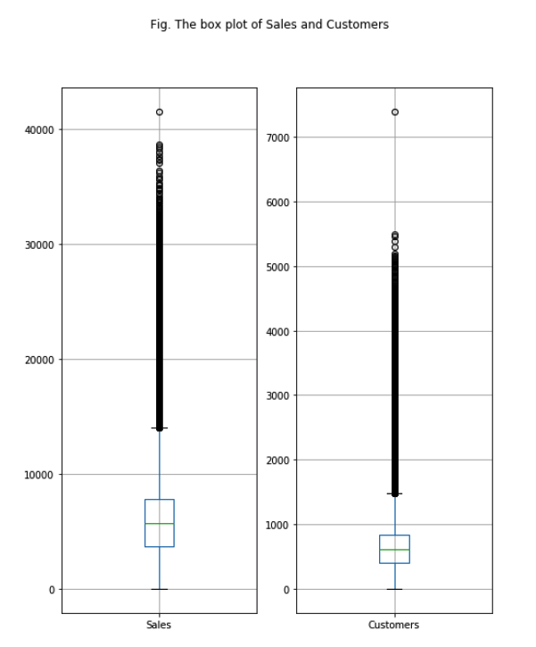
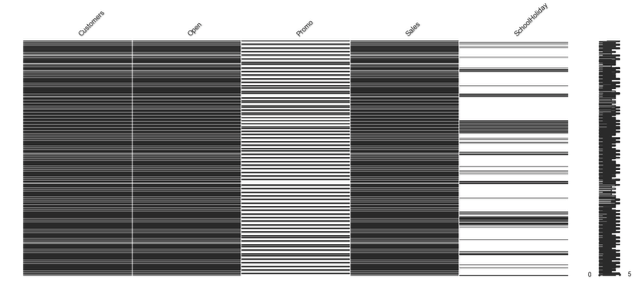
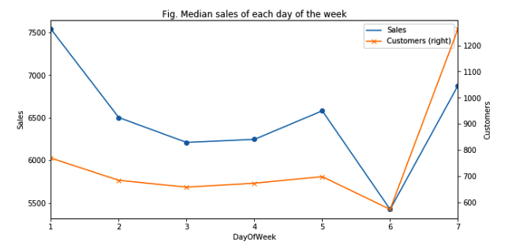
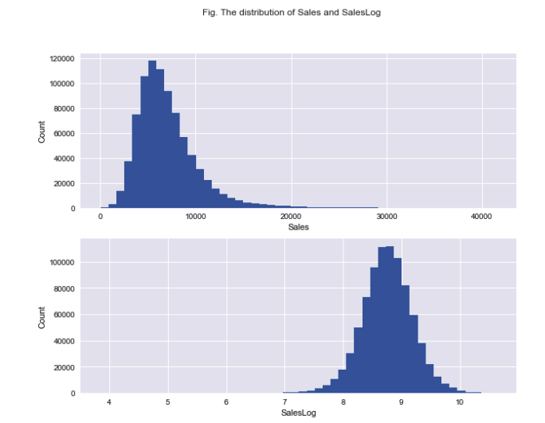
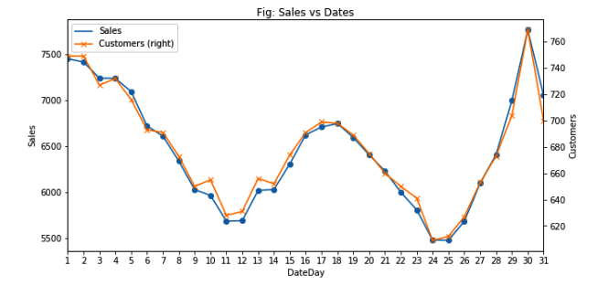
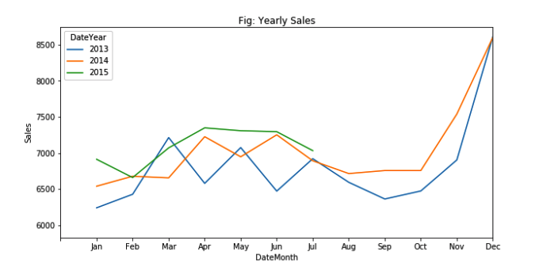
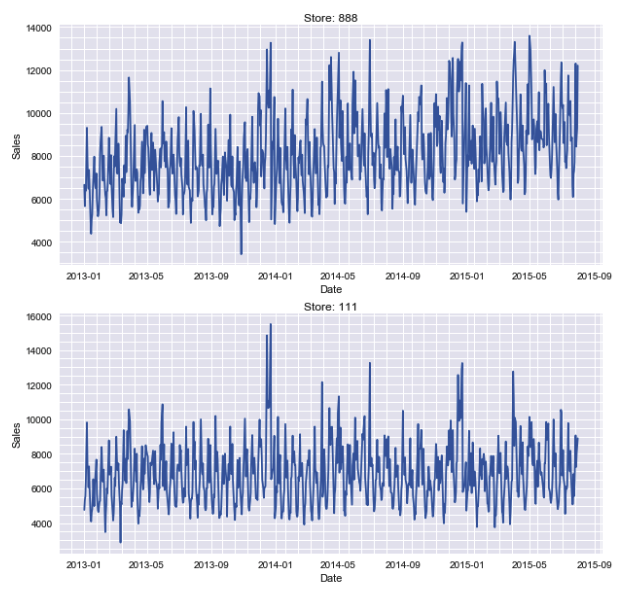
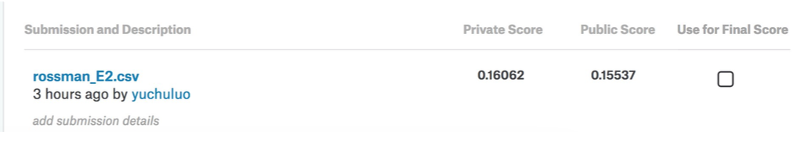
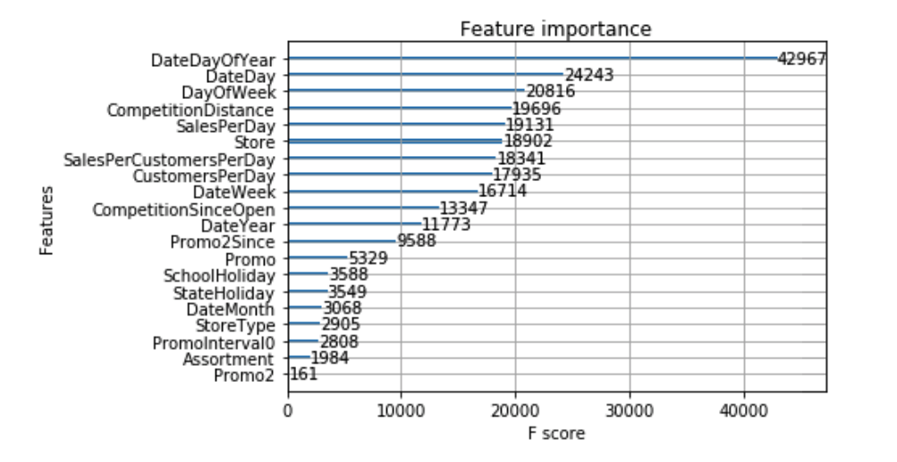
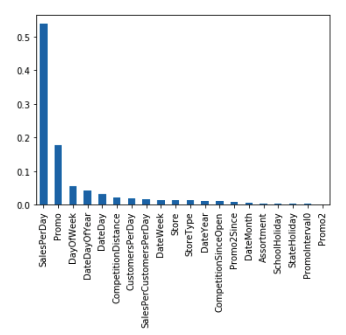

# Rossmann 销售额预测模型

## 机器学习纳米学位-毕业项目
 罗宇矗 </br>
2050年2月28日
 

## I. 问题的定义

### 项目概述
项目将训练一个回归预测器预测德国 1,115 家 Rossman 店铺六周内的日销量。（[Kaggle 赛题地址](https://www.kaggle.com/c/rossmann-store-sales)）

Rossmann 在欧洲的七个国家拥有超过 3000 家药店，这些店铺的销量受推广、竞争者、学校假期、季节和位置等因素的影响。然而当商店经理基于这些独特的状况对销售额作预测时，其结果的准确率变化非常大。

项目采用的模型是 XGBoost、GBDT 和 RandomForest，Kaggle 比赛中第一名采用的是 XGBoost 模型，这里也以它为主。

Rosmann 提供了"train.csv"和"stores.csv"两个包括销售数据和店铺信息的数据集，同时还有一个"test.csv"的数据集，字段和"train.csv"一样，只是缺少需要提交的"Sales"字段。


### 问题陈述
项目选择的数据集都是 Rossmann 的真实数据，需要根据这些数据预测具体每天销售量。事实上影响销售量的因素肯定不是只有 Rossmann 提供的影响因素，还包括天气信息等，而这些不确定的变量都会造成模型的欠拟合。

除可视化之外第一步是特征工程，首先预处理数据，对缺失值和异常值进行填补或丢弃，按照时间时间顺序划分训练集和测试集，接着进行将种类特征（Categorical data）进行独热编码（One-hot Encoding），对部分数值特征（Numerical data）离散化等操作，然后再对这些原有特征进行提取、融合，从而生成一定数量的新特征。由于项目的特征较少，所以特征选择是由人工进行的，且这里大部分特征都得到了保留。

第二步是训练 XGBoost 和 DecisionTree 两个模型，再选择一个表现最好的权重对他们进行融合。理论上来讲，融合模型的效果是大于单个模型的。

### 评价指标
这是一个回归预测问题，其评价指标是 RMSPE（均方根误差），它是预测值与实际值偏差的平方比上预测次数 N 的平方根，公式如下
$$ RMSPE = \sqrt{\frac{1}{n} \sum_{i=1}^{n}{(\frac{y_i - \hat{y_i}}{y_i})^2}}$$
（$y_i$ 代表商店指定日期指定时间的销售量，$\hat{y_i}$ 代表预测值，当日销售额为 0 的商店会被忽略）
由于 Sales 偏斜较大，我对他进行了取 log1p 的操作，所以这里的预测值和实际值在训练中会用 SalesLog 替代，但最终评价时仍会将其还原为商店的销售额。

RMSPE 对一组预测中的特大或特小误差反映非常敏感，因而它能够很好地反映出模型预测的精密度。对于项目中需要预测的销售量，采用 RMSPE 能够很好地表示模型的效果。

## II. 分析


### 数据的探索
项目共使用 3 个数据文件，分别是用来训练模型的”train.csv“，包含 Rossmann 商店信息的“store.csv“和需要预测 Salse 的”test.csv“。他们共提供的 1,115 个店铺的历史销售记录，还包括一个商店信息数据集，具体字段信息如下：

| 字段名 | 含义 |
| --- | --- |
| Id  | 代表测试集里的一个 (Store, Date) |
| Store |  每个商店独有的 Id |
| Sales | 销售额 （测试集中需要预测） |
| Customers | 客流量 |
| Open | 商店是否处于营业状态 |
| StateHoliday | 国家假日类型. a 代表公休假日，b 代表复活节，c 代表圣诞节，0 代表不处于假日状态 |
| SchoolHoliday | 商店是否受学校放假的影响 |
| Storetype | 商店的类型， a,b,c,d 四种 |
| Assortment | 商店销售品的分类等级 |
| CompetitionDistance | 和最近竞争者的距离 |
| CompetitionOpenSince[Month/Year] | 最近的竞争者开张时大概的年（月） |
| Promo | 商店当天是否处于促销状态 |
| Promo2 | 商店是否处于一个持续的促销状态中 |
| Promo2Since[Year/Week] | 店铺开始参与 Promo2 的年（月）份 |
| PromoInterval | Promo2 持续运行的间隔 |

从上表可见需要处理大量和时间有关的特征，在对这些数据的初步观查中，可以看到 “Promo2”，“Open” 等几个字段里有较多的缺失值。对于二元特征（值只能为 1 或 0）可以比较合理的填充他们的缺失值，比如如果 Open 缺失，则当 Sales > 0 时为 1，反之为 0。

对离群值的检测可以用四分位距或者方差的来做，主要是针对 Customers 和 Sales 这两个特征，检测完后可以直接丢弃，也可以用剩余数据所训练的模型预测出新值来填充。


### 探索性可视化

这是 Sales 和 Customers 的箱形图，可以看到两个均有较多的离群值。


这是 Customers, Open, Promo 等几个特征的缺失情况，可以看到 Customers, Open 和 Sales 的缺失情况基本是一致的，因此在预处理时可通过简单过滤来丢弃缺失值。



这是一周中每一天的平均销售量的折线图，可以观测到，每周的开始，商店的客流量和销售额都呈下降趋势，在周末的时候又会出现一的激增，但是一个有趣的现象是周末有更多的客流量，但是其人均销售额却降了下来。


图（上）是销售额（Sales）的分布情况，它有比较大的倾斜，所以我采用了取 log1p 的方式对它进行了预处理，处理之后的分布情况是上图（下）。


这是一月中销售量和客流量的变化折线图，从图中可知，月底月末和月中销售量和客流量比较大，说明处于一个月的哪个位置的这个特征会对销售额的预测有不小的作用。


这是 2013 至 2015 年各月份平均销售量的变化折线图，可以看到年底是消费高峰期。


这是对具体两个商店销量变化的曲线图，可以看到商店间的变化趋势比较相似，但偶尔会有比较大的离群值的出现。


### 算法和技术
从上文的可视化中可以看到销售额与时间密切相关，但还会有很多其它特征对它造成影响，比如离竞争者的距离、是否处于学校放假期间和是否有进行广告推广等等。而且数据中的缺失值和离群值都会对销售额的预测造成影响，为了达到最好的预测精确度，首先需要丢弃掉数据中 Sales 和 Customers 这两个重要特征值偏离正常值过大的数据，这里我采用了 Tukey Method。

第二步数据预处理，包括处理缺失值和对重要特征进行合适的改变或根据旧特征生成部分新特征以方便训练模型。

第三步我用 cross_validation.train_test_split 将训练数据随机地划分为训练集和测试集，之后便开始训练 XGBoost 和 DecisionTree 两个模型。

- **XGBoost**：Gradient Boosting 本身优秀的性能加上 XGBoost 高效的实现能令它在本项目中很好的表现，而且 Kaggle 比赛的第一名主要就是采用了这个算法对结果进行预测。XGBoost 自定义了一个数据矩阵类 DMatrix，会在训练开始时进行一遍预处理，从而提高之后每次迭代的效率。需要调试的主要参数如下
    - eta: Shtinkage 参数，用于更新子节点权重时，乘以该系数，相当于学习率
    - nthread: 线程数
    - subsample: 样本随机采样，较低的值使得算法更加保守，防止过拟合，但是太小的值也会造成欠拟合
    - colsample_bytree: 列采样，对每棵树的生成用的特征进行列采样.一般设置为： 0.5-1 
- **DecisionTree Regression**： 决策树回归模型通过从数据特征中学习决策规则来训练模型，运行速度较快，能够根据赛题的特征来学习规则，从而实现较好的预测。这里需要调试的参数主要是 min_samples_split，max_depth 和 min_samples_leaf，方法采用的是 grid_search 选择较优参数。

### 基准模型
项目采用最终作为 Public Score 的 RMSPE 作为评价指标，其分数越低模型性能越好。

基准是 0.2，这是我靠假设得到的，当 score 为 1/5 时可以说明模型能有个合格的表现，这也是 70% Kaggle 选手能达到的基准。项目将以此为基准对模型进行优化。

## III. 方法

### 数据预处理
首先我处理了离群值，离群值的出现通常会使模型的预测结果出现比较大的偏差，项目采用的是 Tukey Method，将 1.5 倍四分位范围外的数据丢弃。处理情况如下：

> Number of outliers in sales = 26701
> Number of outliers in customers = 38095
> Number of common outliers = 18985
> 1.90198062454 % dropped

第二步是对缺失值用 0 进行填充，之后对时间数据进行了比较细致的处理，，主要是将包含年月日的日期分解为 DayOfYar、DayOfMonth、MonthOfYear 等特征。同时商店信息中包含的竞争者信息和推广信息这里也进行了处理，比如将竞争者开张的时间先联合而后转变为 Float 值，提取推广间隔月信息作为新特征等。

然后将处理后的特征通过 pandas 的 merge 方法合成到包含所有数据的 DataFrame 中，这就完成了数据的预处理过程。

### 执行过程
首先使用 cross_validation.train_test_split 将训练数据随机地划分为训练集和测试集。

接着开始训练 XGBoost 模型，使用的参数如下：

```
'bst:max_depth':12, 'bst:eta':0.0095, 'subsample':0.8, 'colsample_bytree':0.7, 'silent':1, 'objective':'reg:linear', 'nthread':6, 'seed':1
```

在训练 4000 轮后得到了最佳本地 score。

之后训练决策树回归预测模型，采用了 grid_search 选择较优参数，结果为 `{'min_samples_split': 30, 'max_depth': None, 'min_samples_leaf': 8}`

其中用到了本地评估函数如下，它将经处理后的 Sales 数据还原并对模型效果进行评估，以方便本地测试(rmspe_xg 也是实现这个效果，只是少了对 Series 处理的一步)。

```
def evaluate(y_pred, y):
    y_pred1 = (np.exp(y_pred) - 1) * 0.985
    y_test1 = (np.exp(y) - 1)
    y_test1 = np.array(y_test1.SalesLog.tolist(), dtype=np.float32)
    return rmspe(y_pred1, y_test1)
```

### 完善
在决策树回归模型的训练中，其初始本地 score 是 0.2600，经过 Grid Search，降低到了 0.2563。

XGBoost 的 Public Score 为 0.15988，决策树回归模型为 0.18030，最后将二者的预测结果以不同比例融合，当以分别将他们乘以 0.65 和 0.35 的系数融合时效果最佳，最终的 Public Score 为 0.15580。

这里应用到了 Ensemble 原理，理论上多个模型融合后的效果总是会比单个模型的效果好，尤其是当模型间的差异较大时。

## IV. 结果

### 模型的评价与验证
最终模型的预测结果由两部分构成，分别是 0.65 乘以 XGBoost 的预测值和 0.35 乘以决策树模型的预测值。最终在 Kaggle 上的表现如图

可以看到他在 Private Score 和 Public Score 相近，且后者大于前者，说明模型的表现合理可信，且超过了基准分数 0.2，且由于这是两个模型的 Ensemble，其泛化性能也会比单个模型要优秀。

### 合理性分析
组成最终模型的两个模型的结果都比基准模型的结果要好，最终模型的表现更是这样。综合决策树模型和 XGBoost 模型在本地以及 Kaggle Leaderboard 的表现可以看到他们确实是合理的，其 Ensemble 模型表现的提升更佳说明了这一点。

## V. 项目结论

### 结果可视化


两张图是 XGBoost 模型和决策树回归模型的特征排序，可以看到两个模型的特征重要性并不十分一致，前者最重要的四个特征是 DateDayOfYear，DateDay，DayOfWeek 和 CompetitionDistance，可见 XGBoost 对时间比较敏感，这个学习器也主要是从 Rossmann 销售额的时间规律中学习；而后者前四个特征是 SalesPerDay，Promo，DayOfWeek 和 DateDayOfYear，其不同点在于最重要的特征是 SalesPerDay 和 Promo，即某店的平均日销售额和是否进行推广是最重要的影响特征，且第一个 SalesPerDay 重要性又远大于 Promo，这说明决策树模型更佳看中商店的特点和是否广告这样的市场特征。

两个模型所作出的特征排序都比较合乎情理，且有一定的差异性，再一次验证了最终模型。

### 对项目的思考
在做这个项目的过程中，有意思的是看到了各种因素均能对最终结果产生大小不一的影响，比如最后的结果可视化，两种模型对各个特征的排序不尽相同，但其结果都很合理。

比较困难的地方有几个，第一个是对各种特征进行格式处理，或增或减，如何生成特征，怎么利用旧特征生成更多更好的新特征都比较令人困惑，还有可视化过程里遇到的一些困难，比如选取何种可视化形式能够使效果更直观，更容易分析；后面的调参也是一个难点，虽然有 grid search 这样的自动化方法，但大概的范围还是要人工敲定，而这又只能凭感觉，且由于时间有限，所能备选的参数也不能有太多。好在虽然困难很多，最后终归是得到了比较好的效果，而且 Score 也是在我的探索之下一步步地有了提升。

### 需要作出的改进
虽然最终模型效果合格，但并不是十分优秀，其 Kaggle 排名也只能说是一般。我认为还可以在下面几个方面对最终模型进行改进：

 - 预处理：项目中对缺失值的方式是简单的用 0 添补，离群值也是直接丢弃，如果能先预训练一个模型对缺失值和离群值进行重新预测也许能得到更好的效果；此外，离群值也许可以采用基于方差的选择会更加合理
 - 模型选择：这里只选用了基于树的决策树模型和 XGBoost 模型，可以尝试一些线性模型来进行 Ensemble
 - 尝试使用 Stacking 方法
 
## 参考文档
- [《Beating Kaggle the
easy way》 By Ying Dong](https://www.ke.tu-darmstadt.de/lehre/arbeiten/studien/2015/Dong_Ying.pdf)
- [如何在 Kaggle 首战中进入前 10%](https://dnc1994.com/2016/04/rank-10-percent-in-first-kaggle-competition/)
- [Understanding XGBoost Model on Otto Dataset](https://www.kaggle.com/tqchen/otto-group-product-classification-challenge/understanding-xgboost-model-on-otto-data)
- [Github: ROSSMANN-KAGGLE](https://github.com/JohanManders/ROSSMANN-KAGGLE)


