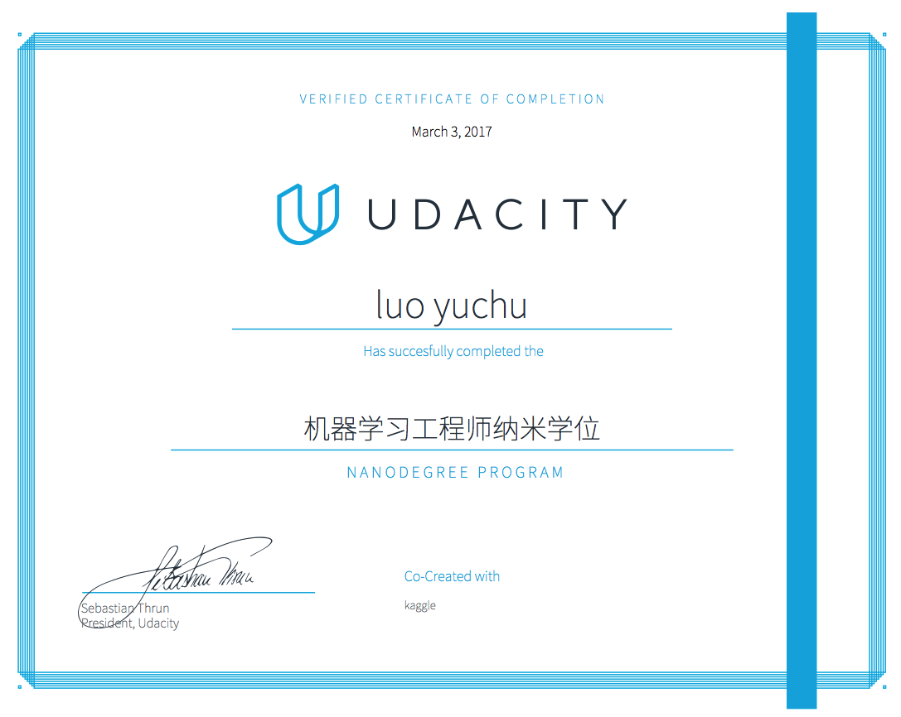

# Machine Learning Engineer Nanodegree

There are all of my projects for Machine Learning Engineer Nanodegree. To solve each of the programs, I applied some of machine learning techniques. Here there is list of my projects:

### Project 1: Predicting Boston Housing Prices
**Primary File:** [1. Boston Housing Prices/boston_housing.ipynb](1.%20Boston%20Housing%20Prices/boston_housing.ipynb)

**Requirements for project 1**

* Evaluating Model Performance
* Model Evaluation & Validation
* Model Optimization

### Project 2: Finding Donors for CharityML
Primary File: [2. Finding Donors/finding_donors.ipynb](2.%20Finding%20Donors/finding_donors.ipynb)

**Requirements for project 2**

Using supervised learning to find donors for CharityML.

* Decision Trees
* Regression & Classification
* Regressions
* Kernel Methods & SVM
* GaussianNB
* Ensemble learning
* RandomForestClassifier

### Project 3: Creating Customer Segments
Primary File: [3. Customer Segments/customer_segments.ipynb](3.%20Customer%20Segments/customer_segments.ipynb)

**Requirements for project 3**

Using unsupervised learning to create customer segments.

* Clustering
* More Clustering
* Feature Scaling
* Feature Selection
* PCA
* Feature Transformation

### Project 4: Train a Smartcab to Drive
Primary File: 4. [Smartcab/smartcab.ipynb](4.%20Smartcab/smartcab.ipynb)

**Requirements for project 4**

Using reinforcement learning to train a smart cab how to drive.

* Markov Decision Processes
* Reinforcement Learning
* Game Theory
* More Game Theory beginning at Stochastic games and Multiagent RL

### Project 5: Build a Digit Recognition Program
Primary File: [5. Digit Recognition/digit_recognition.ipynb](5.%20Digit%20Recognition/digit_recognition.ipynb)

In this project, I used deep neural networks and convolutional neural networks to create a program that prints numbers it observes in real time from images it is given. 

### Capstone: Rossmann 销售额预测模型
See the detail: [Capstone](Capstone)

